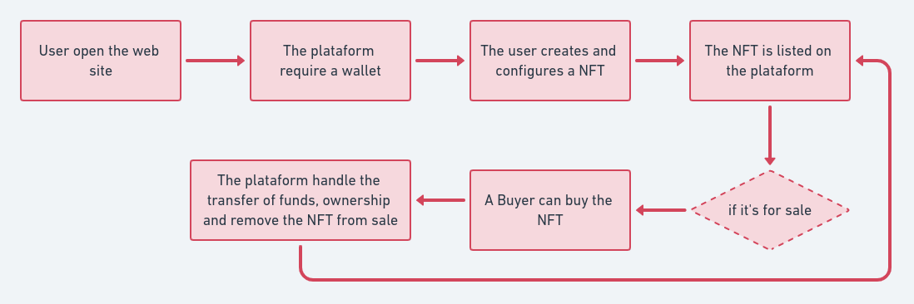
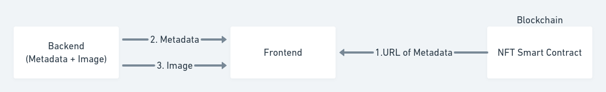

# Anime NFT Marketplace

  
 

# Summary

- [About](#about-project)
- [Architecture and Client-side Flow](#architecture)
- [Demo](#demo)
- [Features](#features)
- [Built with](#built-with)
- [Development Challenges](#development-challenges)
- [Wishlist](#wishlist)
- [Troubleshooting](#troubleshooting)

<a id='about'/>

## About Project

This full-stack DApp Anime NFT Marketplace was created as a research project to find out more about how to create smart contracts and use blockchain technology.
Made with Vercel, Hardhat, ReactJS, NextJS, NodeJS, and Solidity.

I want to make the nft market accessible and secure for everyone.   This project's goal is to develop a open source nft marketplaces rather than running a nft marketplace. Because of this, forking and customising this marketplace makes it simple to develop numerous nft marketplaces. We will benefit from supporting the artists in this way. We must come from many backgrounds and work together if we are to prosper in the world.
<a id='architecture' />

## Architecture and Client-side Flow
**Architecture**

**Client-side Flow**

The user must have the Metamask wallet installed in order to access the app using a web browser. The web3.js package is used by this React.js-created interface to communicate with the smart contracts via Metamask. This indicates that the information displayed on the front-end application is downloaded from the Ethereum blockchain. Each user activity (minting an NFT, making an offer, purchasing an NFT, etc.) generates an Ethereum transaction that must be confirmed by Metamask and incurs a tiny charge. This transaction permanently changes the state of the NFTCollection and NFTMarketplace smart contracts. The user will then add the NFT Metadata to the IPFS and upload it there, generating a permanent hash that will be permanently recorded on the blockchain itself to demonstrate ownership.

## Demo
https://user-images.githubusercontent.com/89217455/197830502-a3fc1cf4-f489-4187-9ab9-580d6da0da0b.mp4

## Features

The user can perform the following actions on this NFT Marketplace:

#### Mint

The user must input a name, description and upload a file (image) to mint his own NFT. Once minted, a representation of this NFT will be displayed in the marketplace and initially it will be owned by its creator. This is open for everyone, meaning everyone can participate in this NFT creation within this collection. 

#### Make Offer

The user can offer his NFT by specifying its price (in Ether). If someone fulfills this offer, then the ownership is transferred to a new owner. 

#### Cancel Offer

The user can cancel an offer he did in the past if in the end he does not want to sell his NFT or wants to adjust the price.

#### Buy

A user can buy those NFT which someone else offered. This will require paying the requested price (the Ether will be transferred to the smart contract to be claimed later on).

## Built With

This project was developed with the following technologies:

#### **Frontend** React + JavaScript + Next.js
  - [React](https://pt-br.reactjs.org/)
  - [Axios](https://github.com/axios/axios)
  - [Redux](https://redux.js.org/)
  - [Web3.js](https://web3js.readthedocs.io/en/v1.3.4/)
  - [Next.js](https://nextjs.org/)

#### **Backend** Express
  - [Express](https://expressjs.com/pt-br/)
 
#### **Blockchain and Smart Contracts** Solidity
  - [Solidity](https://docs.soliditylang.org/)
  - [Hardhat](https://hardhat.org/docs)

## Development Challenges

- Updating NFT UI Cards after an action was performed
- Addressing [Metamask's accountsChanged event being fired twice on mobile] (https://github.com/MetaMask/metamask-mobile/issues/2162)
- Construction of a Web3 context provider
- Investigating several issues that led to "Estimate gas failed" errors\*

_\* They are typically brought on by inaccurate contract addresses and inaccurate default gas values._

## Wishlist

- Refactor frontend code to accept other networks besides Mumbai
- Lazyload for NFTs images and metadata
- Add support for custom ERC20 tokens as payment 

## Troubleshooting

### Mumbai marketplace setup command is breaking with a 'estimate gas failed' error

Try changing `hardhat.config.js` mumbai gas values.  
I'm using the ones I've found here:  
https://forum.moralis.io/t/deploy-to-polygon-matic-mumbai-fails/700

### Nouce is too high

Reset your Metamask account transaction history.  
Find out more on:  
https://medium.com/@thelasthash/solved-nonce-too-high-error-with-metamask-and-hardhat-adc66f092cd

## :mailbox_with_mail: Get in touch!

 
 
  Made with :coffee: and ❤️ by <b>Nisarg Thakkar</b>.

